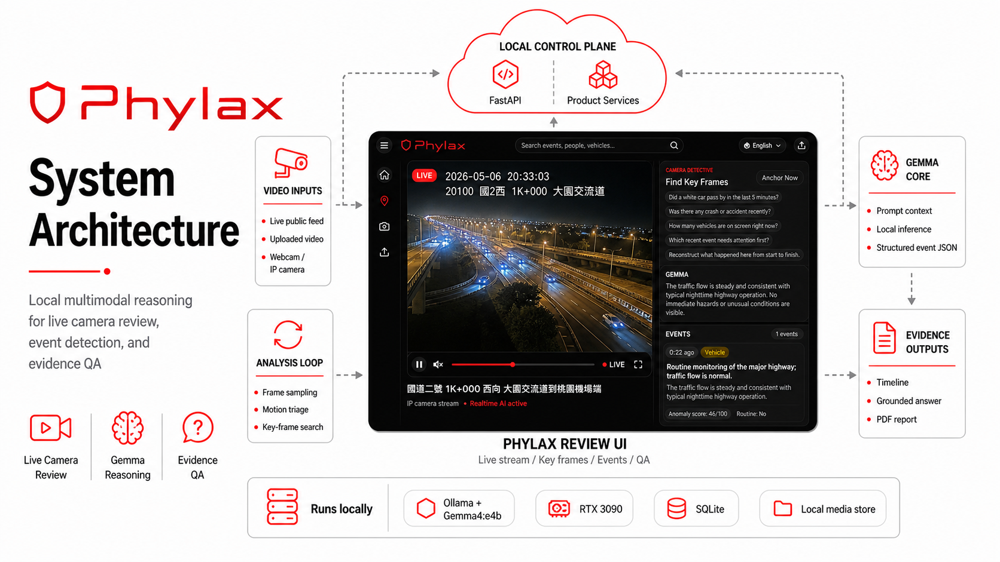

# Phylax

AI-powered video surveillance review for uploaded clips and live IP/MJPEG cameras.
Phylax uses a local Ollama vision model to summarize events, search timelines,
answer investigation questions, and generate concise reports.

[](https://phylax-cam.com/)




## Features

- Upload videos and generate AI event timelines.
- Connect live cameras and review recent activity.
- Ask natural-language questions about video evidence.
- Search across summaries, keywords, timestamps, and camera events.
- Run locally with optional Cloudflare Tunnel exposure.

## Hardware Recommendation

| Use case | Recommended hardware |
| --- | --- |
| Demo / light testing | 4-core CPU, 16 GB RAM |
| Smooth local analysis | 8-core CPU, 32 GB RAM, NVIDIA GPU with 8 GB+ VRAM |
| Multi-camera review | 12-core CPU, 64 GB RAM, NVIDIA GPU with 12 GB+ VRAM |

FFmpeg is recommended for camera streams and exports. GPU acceleration depends on
your Ollama model/runtime setup.

## Install

Requirements: Python 3.9+, Node.js LTS, npm, Ollama, and FFmpeg.

```bash
git clone https://github.com/<your-org>/phylax.git
cd phylax
cp .env.example .env
ollama pull gemma4:e4b
```

Linux packages commonly needed by OpenCV/FFmpeg:

```bash
sudo apt-get update
sudo apt-get install -y ffmpeg libgl1 libglib2.0-0
```

## Run

The launcher creates `.venv`, installs backend/frontend dependencies, and starts
both services:

```bash
bash start.sh
```

Open `http://localhost:5173`.

Useful commands:

```bash
bash start.sh stop
PHYLAX_TUNNEL=0 bash start.sh
```

Manual startup:

```bash
cd server
python -m venv ../.venv
../.venv/bin/python -m pip install -r requirements.txt
../.venv/bin/python main.py

cd ../frontend
npm install
npm run dev
```

Backend API docs are available at `http://127.0.0.1:8000/docs` when
`EXPOSE_API_DOCS=1`.

## Configuration

Edit `.env` after copying `.env.example`.

| Variable | Purpose |
| --- | --- |
| `OLLAMA_HOST` | Ollama server URL |
| `MODEL_NAME` | Default multimodal model |
| `PHYLAX_API_TOKEN` | Optional API token for public deployments |
| `PHYLAX_TUNNEL` | Enable/disable Cloudflare Tunnel in `start.sh` |
| `TDX_CLIENT_ID`, `TDX_CLIENT_SECRET` | Optional Taiwan TDX CCTV provider credentials |

Never commit `.env`, tunnel tokens, runtime databases, uploaded videos, or frame
captures.

## Technology

- Frontend: Vite, vanilla JavaScript, CSS
- Backend: FastAPI, Uvicorn, Python
- AI: Ollama with Gemma 4 vision models
- Video: OpenCV, Pillow, FFmpeg
- Data: SQLite via `aiosqlite`, local media storage
- Optional exposure: Cloudflare Tunnel

## Project Structure

```text
frontend/          Vite client
server/            FastAPI service
server/routers/    API routes
server/services/   AI, camera, search, report, and cleanup logic
server/data/       Runtime DB/media, ignored by git
```

## License

Add your preferred open-source license before publishing.
